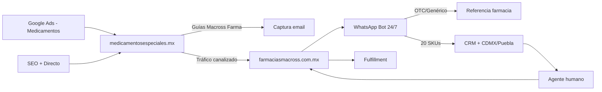

# FARMACIAS MACROSS — Sinergia Digital
## Ecosistema Digital para Medicamentos Especializados

**Cliente**: Farmacias Macross | **Proyecto**: FM | **Duración**: 34 semanas (9 + 25) | **Total**: $508,500 MXN (sin IVA) | **Con IVA 16%**: $589,860 MXN

> **Estado**: Fases 1 y 2 entregadas a tiempo. Fases 3-7 propuestas (5 sem c/u).

---

## Resumen Costos y Tiempos

| Fase | Componentes | Duración | Inversión | Estado |
|------|-------------|----------|-----------|--------|
| 1 | Hostinger + 20 blogs especialidades + SEO + Legal | 5 sem | $62,000 - $88,000 | Entregada |
| 2 | Google Ads + GA4 + GTM + Dashboard Looker Studio + [Shopify] GA4+QA | 4 sem | $80,500 | Entregada |
| 3 | Ads medicamentos, guías Macross Farma (email), contenido, canalización a Macross | 5 sem | $70,000 | Propuesta |
| 4 | [Shopify] Mejora Storefront — PDPs (conversión, velocidad) | 5 sem | $60,000 | Propuesta |
| 5 | [Shopify] Scripts/Apps, Cookies, GMB/Merchant | 5 sem | $70,000 | Propuesta |
| 6 | WhatsApp API + Chatbot lógica filtrado | 5 sem | $70,000 | Propuesta |
| 7 | CRM, integración sitio↔WhatsApp, capacitación, 5 lead magnets (opc.) | 5 sem | $70,000 | Propuesta |
| **TOTAL** | Sistema completo operativo | 34 sem | **$508,500** | — |

**Objetivo**: (1) **medicamentosespeciales.mx** — Sitio informativo sin WhatsApp, compliant para pautar sin restricciones. Conexión con **guías descargables de Macross Farma** para captar emails y calificar tráfico. (2) **Ads a medicamentos** para maximizar alcance y publicidad. (3) Todo el tráfico ya canalizado se envía a **Macross (Shopify)**, donde se busca la conversión. WhatsApp, bot y CRM operan solo en lado Macross. Cumplimiento COFEPRIS.

---

## Fases y Entregables

### FASE 1: Hostinger Fachada (5 sem) — Entregada
**Subtotal**: $62,000 - $88,000 MXN

> Sitio web informativo que cumple políticas de Google Ads y COFEPRIS. Permite pautar sin restricciones y posicionar orgánicamente en buscadores.

- [x] 1.1 Auditoría y arquitectura — $7,000
  *Análisis del sitio actual, mapa de contenido y estructura técnica optimizada para SEO.*
- [x] 1.2 Sitio rediseñado (8 páginas: Home, Sobre nosotros, Blog, Catálogo, Consulta, FAQ, Legal, Contacto) — $20,000 - $42,000
  *Diseño profesional responsive con formularios de contacto y llamadas a la acción claras.*
- [x] 1.3 20 blogs especialidades (contenido informativo, schema, CTAs) — $16,000
  *Artículos educativos sobre especialidades médicas que atraen tráfico orgánico de Google.*
- [x] 1.4 SEO técnico + Compliance legal (sitemap, robots, COFEPRIS, Search Console) — $18,000
  *Configuración técnica para indexación correcta y cumplimiento normativo farmacéutico.*

---

### FASE 2: Setup Google Ads + Dashboards (4 sem) — Entregada
**Subtotal**: $80,500 MXN | *Setup inicial. Operación mensual: responsabilidad del cliente.*

> Infraestructura de publicidad digital lista para activar. Campañas configuradas, medición completa y panel de control para monitorear resultados en tiempo real.

- [x] 2.1 Google Ads + GA4 + GTM — $45,000
  *Cuenta publicitaria estructurada con 3 campañas listas para activar, seguimiento de conversiones y remarketing configurado. Incluye documentación de 20 páginas.*
- [x] 2.2 Dashboard Looker Studio — $15,000
  *Panel ejecutivo con métricas de tráfico, campañas, SEO y conversiones. Actualización automática y acceso desde cualquier dispositivo.*
- [x] 2.3 [Shopify] GA4 + QA — $20,500
  *Medición de eventos de ecommerce en Shopify: vistas de producto, carrito, compras. Pruebas de calidad del flujo completo.*

---

### FASE 3: Incremento de interacciones (5 sem) — Propuesta
**Subtotal**: $70,000 MXN

> Más tráfico con Ads a medicamentos (sin restricciones). Conexión **medicamentosespeciales ↔ guías descargables Macross Farma** para captar emails; tráfico canalizado a Macross para conversión.

- [ ] 3.1 5 artículos + 5 blogs interconectados — $8,000
  *Contenido educativo nuevo que posiciona en Google y atrae pacientes buscando información de medicamentos.*
- [ ] 3.2 Gestión Google Ads 5 semanas — $16,000
  *Campañas a medicamentos para máxima publicidad sin restricciones; optimización, reportes semanales.*
- [ ] 3.3 Research + estrategia contenido (keyword, matriz, CTAs, briefs) — $13,000
  *Investigación de palabras clave rentables, matriz de temas y briefs para los artículos y contenido de esta fase.*
- [ ] 3.4 Actualización contenido productos (SEO & AI first) — $10,000
  *Mejora de descripciones de productos en Macross para mejor posicionamiento y claridad.*
- [ ] 3.5 Guías descargables Macross Farma + optimización conversión — $23,000
  *Guías descargables en medicamentosespeciales (sin WhatsApp) a cambio de email; pop-ups, sticky bar, CTAs hacia Macross; tráfico canalizado a Macross para conversión.*

**Opcionales Fase 3:**
| Add-on | Descripción | Inversión |
|--------|-------------|-----------|
| Video corto (AI-assisted) | 30-60 seg con Notebook LM/Veo + edición básica para Ads/sitio | $4,000 |
| 5 artículos adicionales | Más contenido SEO para posicionamiento | $8,000 |

---

### FASE 4: [Shopify] Mejora Storefront — PDPs (5 sem) — Propuesta
**Subtotal**: $60,000 MXN

> Optimización enfocada en las Páginas de Producto (PDPs) para aumentar conversión. Las PDPs son donde el cliente decide comprar.

- [ ] 4.1 Rediseño PDPs (layout, galería de imágenes, información de producto, CTAs) — $25,000
  *Estructura optimizada de página de producto: fotos de alta calidad, descripción clara, precio visible y botón de compra prominente.*
- [ ] 4.2 Performance PDPs (optimización imágenes, lazy load, Core Web Vitals) — $18,000
  *Páginas de producto más rápidas = menos abandonos. Mejoras técnicas que reducen tiempo de carga.*
- [ ] 4.3 Elementos de conversión en PDPs (trust badges, reviews, stock, urgencia, cross-sell) — $12,000
  *Sellos de confianza, indicadores de disponibilidad, productos relacionados y elementos que generan acción.*
- [ ] 4.4 PDPs responsive y accesibilidad móvil — $5,000
  *Experiencia de compra perfecta desde celular donde ocurre 70%+ del tráfico.*

**Opcionales Fase 4:**
| Add-on | Descripción | Inversión |
|--------|-------------|-----------|
| Rediseño Home + Colecciones | Mejora visual más allá de PDPs | $20,000 |
| Quick view / Búsqueda predictiva | Funcionalidades UX avanzadas | $12,000 |

---

### FASE 5: Settings básicos (5 sem) — Propuesta
**Subtotal**: $70,000 MXN

> Configuraciones técnicas para medición avanzada, cumplimiento de privacidad y presencia en Google Maps/Shopping.

- [ ] 5.1 [Shopify] Scripts/Apps/Tracking — $28,000
  *Instalación de apps esenciales y scripts de seguimiento para medir comportamiento de compra con precisión.*
- [ ] 5.2 [Shopify] Cookies/Consent — $12,500
  *Banner de consentimiento de cookies conforme a regulaciones de privacidad (LFPDPPP México).*
- [ ] 5.3 Google Business + Merchant Center — $29,500
  *Perfil de negocio en Google Maps optimizado + catálogo de productos en Google Shopping.*

**Opcionales Fase 5:**
| Add-on | Descripción | Inversión |
|--------|-------------|-----------|
| Schema markup avanzado (FAQ, HowTo) | Datos estructurados para rich snippets en Google | $10,000 |
| Bing Places + Apple Maps | Presencia en otros buscadores/mapas | $6,000 |

---

### FASE 6: Captación I — WhatsApp y Bot (5 sem) — Propuesta
**Subtotal**: $70,000 MXN

> Automatización de atención inicial 24/7 vía WhatsApp. El bot filtra consultas simples y solo escala a agentes humanos los prospectos calificados.

- [ ] 6.1 WhatsApp Business API — $22,000 | *Costo mensual proveedor no incl. (~$50-100 USD/mes)*
  *Cuenta empresarial verificada con número único, mensajes automatizados y conexión a sistemas.*
- [ ] 6.2 Chatbot lógica filtrado (Rama A: OTC/ref; Rama B: 20 SKUs→CRM→agente) — $48,000
  *Bot que identifica tipo de consulta: redirige OTC/genéricos a farmacia general y especialidades a vendedor humano.*

**Opcionales Fase 6:**
| Add-on | Descripción | Inversión |
|--------|-------------|-----------|
| Flujo de citas/consultas | Agendamiento automatizado vía bot | $18,000 |
| Notificaciones proactivas | Recordatorios de recompra, seguimiento | $12,000 |
| Integración Shopify ↔ WhatsApp | Notificaciones de pedido directo a cliente | $20,000 |

---

### FASE 7: Captación II — CRM e integraciones (5 sem) — Propuesta
**Subtotal**: $70,000 MXN (o $53,000 sin 5 lead magnets)

> Sistema centralizado para gestionar todos los prospectos. Asignación automática por zona (CDMX/Puebla) y capacitación del equipo para operar el ecosistema.

- [ ] 7.1 CRM + pipeline + automatizaciones geográficas — $30,000
  *Sistema para ver todos los prospectos, su estado y asignarlos automáticamente al centro más cercano.*
- [ ] 7.2 Integración medicamentosespeciales → CRM — $10,000
  *Formularios y emails capturados (guías Macross Farma) en medicamentosespeciales fluyen al CRM; WhatsApp solo en lado Macross.*
- [ ] 7.3 Capacitación operativa (manual, 4 sesiones 7h) — $13,000
  *Entrenamiento práctico al equipo: uso de CRM, atención por WhatsApp, dashboard y mejores prácticas.*
- [ ] 7.4 5 Lead Magnets (opc.) — $17,000
  *Recursos adicionales descargables para capturar más datos de contacto de prospectos.*

**Opcionales Fase 7:**
| Add-on | Descripción | Inversión |
|--------|-------------|-----------|
| Email marketing (setup + 5 secuencias) | Automatización de emails post-captura | $35,000 |
| Dashboard operativo por centro | Panel específico CDMX vs Puebla | $15,000 |
| Integración inventario Shopify ↔ CRM | Stock en tiempo real para vendedores | $22,000 |
| Playbook operativo extendido | SOPs detallados + videos tutoriales | $10,000 |

---

### Complementos (Add-ons)

> Servicios opcionales que pueden agregarse a cualquier fase según necesidades.

- [Shopify] Performance móvil — $30,600
  *Optimización avanzada de velocidad específica para dispositivos móviles.*
- 5 Lead Magnets extra — $30,000
  *Recursos descargables adicionales: guías, checklists, ebooks para captura de leads.*

---

## Esquemas de Pago

**Opción A - Pago por Fases (Recomendado)**

| Pago | Monto | Trigger |
| ------ | ----- | ------- |
| Pago 1 | $22,000 MXN | Fase 0 + Anticipo Fase 1 |
| Pago 2 | $66,000 MXN | Cierre Fase 1 |
| Pago 3 | $40,250 MXN | Anticipo Fase 2 |
| Pago 4 | $40,250 MXN | Cierre Fase 2 |
| Pago 5 | $70,000 MXN | Cierre Fase 3 |
| Pago 6 | $60,000 MXN | Cierre Fase 4 (Storefront) |
| Pago 7 | $70,000 MXN | Cierre Fase 5 |
| Pago 8 | $70,000 MXN | Cierre Fase 6 |
| Pago 9 | $70,000 MXN | Cierre Fase 7 |

**Total**: $508,500 MXN (sin IVA). *Fases 3-7: 5 sem c/u; Fase 4: $60k.*

**Opción B - Pago único anticipado (Descuento 10%)**

**Opción C - Plan de mensualidades (4 meses)**

*(Pautas publicitarias, herramientas SaaS y costos de terceros no están incluidos.)*

**Todos los costos sujetos a cambios por workflows/requerimientos especiales.**

---

## Arquitectura

> **medicamentosespeciales.mx** no tiene WhatsApp: solo contenido, guías descargables Macross Farma (captura de email) y CTAs hacia Macross. Todo el tráfico se canaliza a **Macross (Shopify)** para conversión; WhatsApp y bot operan solo en lado Macross.

---

## Multi-centro

> El sistema está diseñado para operar múltiples sucursales con asignación inteligente de leads.

- **CDMX y Puebla** activos; asignación automática por zona; dashboards independientes por centro
- **Expansión**: lógica pre-configurada; activar nuevo centro en CRM en minutos sin desarrollo adicional

---

## Post-entrega: responsabilidades del cliente

> Una vez entregado el sistema, estas son las actividades que el equipo de Farmacias Macross operará día a día.

- **Ads**: Presupuesto mensual ($12k-40k MXN estimado), aprobación de nuevas campañas, monitoreo del dashboard
- **Leads**: Bot filtra 24/7 automáticamente; agentes humanos atienden solo prospectos calificados (1-2 por turno)
- **Contenido**: Opcional producir contenido adicional con equipo interno o freelancers

---

## Garantía y soporte

> Cobertura post-entrega incluida sin costo adicional.

- **60 días garantía técnica**: corrección de bugs, ajustes de integraciones, optimización de performance y tracking
- **45 días soporte**: respuesta vía WhatsApp/email en menos de 4 horas + 2 sesiones de revisión con el equipo

---

## Requisitos del cliente

> Información y accesos que necesitamos de Farmacias Macross para avanzar en cada fase.

- **Arranque**: Accesos a Hostinger, Shopify y hosting; logo en alta resolución; direcciones de centros CDMX/Puebla
- **Fases 1-2**: Retroalimentación de wireframes en 72h; lista definitiva de 20 SKUs especializados; aprobación de artículos; información para lead magnets
- **Fase 2**: Definir presupuesto mensual de Ads; tarjeta corporativa para Google; accesos a Google Ads y Analytics
- **Fases 6-7**: Número WhatsApp corporativo dedicado; documentos legales de la empresa; equipo disponible para capacitación (4 sesiones de ~1.5h)

---

## Exclusiones

> Costos que NO están incluidos en esta propuesta y son responsabilidad del cliente.

- **Infraestructura**: Hosting, dominios, costo mensual de WhatsApp API (~$50-100 USD/mes), licencias CRM de pago
- **Operación**: Presupuesto mensual de publicidad en Google Ads, gestión mensual de campañas post-entrega, producción de contenido adicional
- **Personal**: Atención de WhatsApp por agentes humanos
- **Resultados**: No se garantizan métricas específicas ni ROI (depende de múltiples factores externos)

---

## Servicios adicionales y paquetes mensuales

> Servicios que pueden contratarse por separado o como paquete mensual recurrente (Ryu maneja todo lo digital).

| Servicio | Alcance | Inversión |
|----------|---------|-----------|
| **Gestión Google Ads** | Hasta 15 h/mes: optimización de campañas, pujas, anuncios, negative keywords, 1 reporte semanal, 1 reunión de revisión al mes | $18,000 MXN/mes |
| **Contenido continuo (blog + sitio)** | Hasta 4 artículos o actualizaciones/mes: research de keywords, briefs, redacción, publicación en blog/sitio; o hasta 20 fichas de producto actualizadas/mes | $14,000 MXN/mes |
| **Soporte técnico extendido** | Bloque de 10 h para bugs, ajustes de tracking, integraciones o dudas técnicas (válido 90 días) | $8,000 MXN (paquete) |
| **Expansión del bot** | Nuevos flujos, integraciones o funcionalidades en WhatsApp | Cotización por proyecto |

---

## Proceso de trabajo

> Cómo trabajamos durante el proyecto.

- **Comunicación**: WhatsApp o Slack con respuesta en menos de 4 horas en horario laboral
- **Reportes**: Avance semanal por escrito cada viernes
- **Reuniones**: Una reunión de kick-off y cierre por cada fase
- **Herramientas**: Jira (tareas), Figma (diseños), Google Drive (documentos compartidos)
- **Aprobaciones**: Máximo 72 horas para aprobar entregables; retrasos del cliente ajustan cronograma

---

## Términos

- **Validez**: Esta propuesta es válida por 20 días a partir de la fecha de envío
- **Precios**: Expresados en MXN, no incluyen IVA (16%)
- **Pagos**: Contra entrega de cada fase según esquema acordado
- **Cambios de alcance**: Cualquier trabajo fuera de lo descrito requiere cotización separada
- **Confidencialidad**: Toda la información del proyecto es confidencial

**Elaborado por**: Ryu E-commerce & Automations
